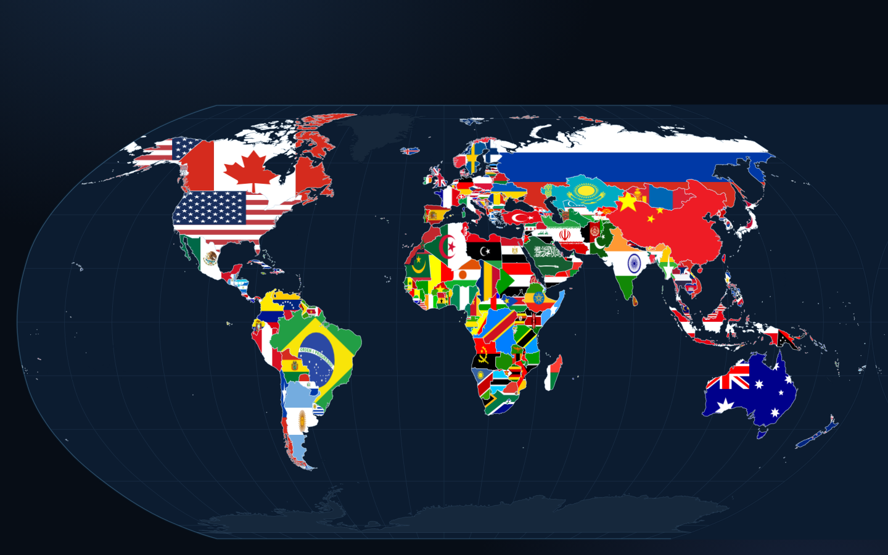

# Atlas Arcade

A drag-and-drop game for learning where every country actually is. Pick a
continent, then drag flags — or names, or both — onto the right patch of the
world map. Every country you place fills in with its own flag, so a finished
continent is a mosaic you built yourself.

Open `index.html` in a browser. That is the whole thing: one self-contained
file, no server, no network, no build step needed to play.



## What's in it

**Pick your region** — the whole world (197 countries), any of the six
continents, *Tiny nations* (the 45 easiest to miss), or *Trouble spots*, which
is assembled from the countries you personally keep getting wrong.

**Pick what you drag**

| Mode | What's on the card |
| --- | --- |
| Flags only | Just the flag. Hardest, and the best test. |
| Names only | Just the name. Pure geography. |
| Flag + name | Both. Best while a continent is still new to you. |

**Pick how you play** — Practice (no clock, no lives), Time rush (fast answers
score more), or Survival (three lives, streak multipliers).

## Reaching the small countries

Microstates are the reason most map games are annoying, so several things
happen at once to make Nauru as easy to hit as Brazil:

- Any country too small to click at the current zoom is drawn as a **pin**,
  and the pin takes the hit instead of the country underneath it — so Vatican
  City wins over Rome, and Lesotho over South Africa. As you zoom in the pins
  fade out gradually rather than blinking off, so a dot never disappears out
  from under the cursor; the true specks keep a faint halo.
- The dragged card **trails below and right of the pointer** instead of
  sitting on top of it, so you can always see the spot you are aiming at.
- A **magnifier** follows the pointer while you drag. It shows a fixed slice
  of the world rather than a fixed multiple of the current zoom, so it never
  becomes a featureless close-up, and it hides itself once you are zoomed in
  far enough that it has nothing to add. Inside the lens the pins stay their
  normal size while the map grows, which is what actually pulls a crowded
  cluster like the Caribbean apart.
- Drops **snap outwards**: landing in the sea a few pixels off a coast, or
  just outside a tiny border, still counts as aiming at that country.
- Zoom with the wheel, pinch, `+`/`-`, double-click, or the buttons; pan by
  dragging. `0` re-frames the region.

If dragging isn't your thing, tap a card and then tap the map — and once
you've placed one this way the next card selects itself, so you can rattle
through a continent by just tapping the map over and over.

## The other bits

- **Progress that remembers.** Every country carries a Leitner-style box
  level in `localStorage`. Three clean placements marks it mastered, a miss
  knocks it back down, and the menu shows a mastery bar per region. The map
  behind the menu flies the flag of everything you have already learned.
- **Hints in three steps** — subregion and capital, then a tightening circle,
  then the answer. Each one costs points and stops that country from counting
  toward mastery.
- **A results card** that lists what you missed, with a *Drill my misses*
  button that starts a round of exactly those.
- **Explore mode** — no scoring, just tap any country for its flag, capital,
  population, area, neighbours, and your own record with it. There's a search
  box, and it flies you to whatever you pick.
- Sound effects, streak banners, confetti, and a magnifier — all toggleable.

## How it is built

```
atlas-arcade/
  index.html          the game — generated, self-contained, ~2 MB
  src/
    index.html        page shell (template)
    styles.css
    app.js            map engine + game logic
  tools/
    build.mjs         assembles index.html from src/ + the data packages
    geo.mjs           TopoJSON decode, Robinson projection, simplify, polylabel
```

To rebuild after editing anything in `src/`:

```sh
cd tools
npm install
npm run build      # writes ../index.html
```

The build projects Natural Earth 1:50m boundaries into a fixed
[Robinson](https://en.wikipedia.org/wiki/Robinson_projection) frame 40 000
units wide (roughly one unit per kilometre), simplifies to a 1 km tolerance,
and emits each country as an integer relative SVG path. Zoom and pan are then
just a `viewBox` on that one projection, which keeps every country in the same
place on the map whichever region you are playing — the point being that you
build one mental map, not six.

A few things the build has to handle:

- **Label anchors** come from a pole-of-inaccessibility search, not a
  centroid, so the pin for Norway or Croatia lands inside the country.
- **Antimeridian crossings** are clipped properly. Left alone, Russia's
  Chukotka drags a filled band straight across the map.
- **The Pacific is drawn twice.** Robinson can't tile horizontally, so playing
  Oceania as one region needs a second copy of the map a world-width east,
  plus a patch covering the lens-shaped gap where the two copies meet.
- **Antarctica** is stored as a degenerate strip along -90° with the coastline
  as a second ring, so polygons are ranked by their largest ring rather than
  their first.
- **Tuvalu** is absent from Natural Earth 1:50m, so it is synthesised at its
  coordinates. It renders as a pin regardless, like the other atolls.

## Data

| | |
| --- | --- |
| Boundaries | [Natural Earth](https://www.naturalearthdata.com/) 1:50m via [world-atlas](https://github.com/topojson/world-atlas) |
| Flags | [flag-icons](https://github.com/lipis/flag-icons) (CC0) |
| Names, capitals, regions, neighbours | [world-countries](https://github.com/mledoze/countries) (ODbL) |
| Population | [country-json](https://github.com/samayo/country-json) |

The default roster is 197: the 193 UN members, the two observer states
(Vatican City and Palestine), plus Taiwan and Kosovo. A settings toggle adds
36 territories and dependencies for a harder round.
